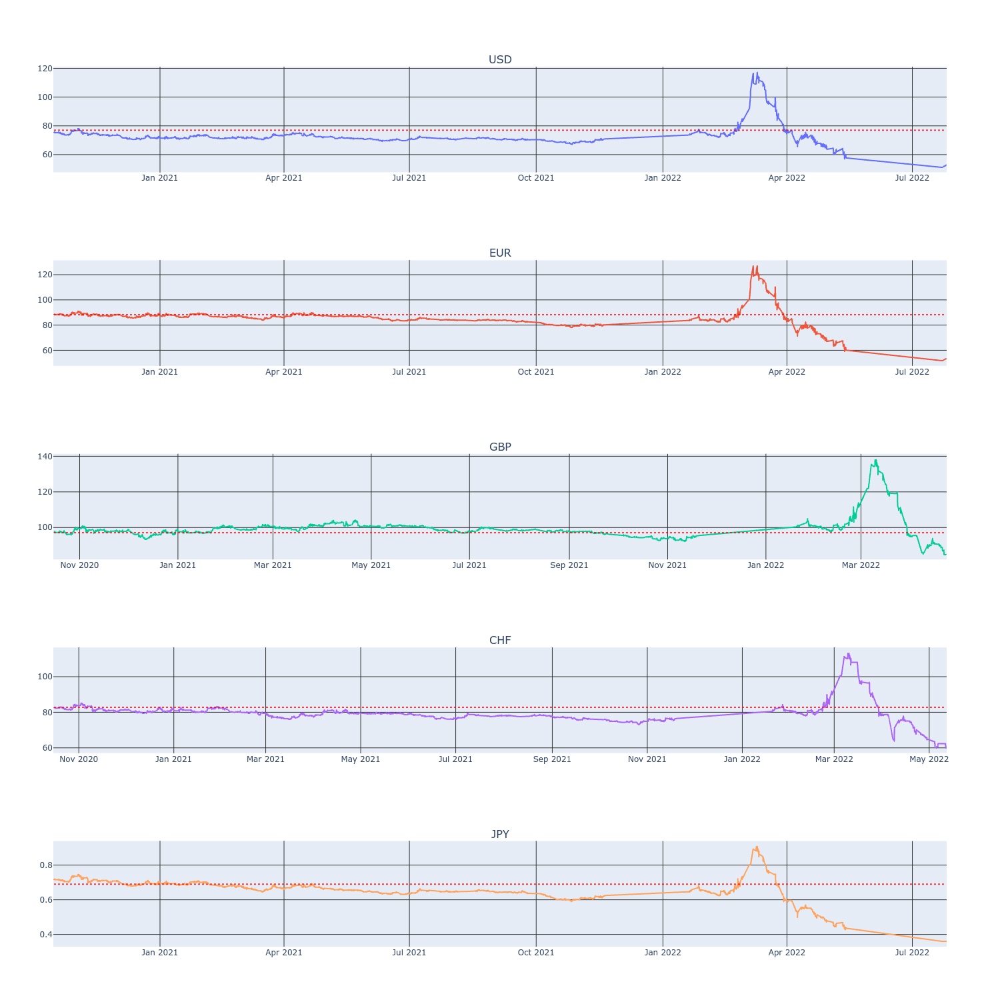

# Currency rates viewer

This viewer shows currency rates which were extracted from a Bank site
by [Web grabber](https://github.com/taras-z/web-grabber) like that:

 

NB. The viewer is based on [Flask](https://flask.palletsprojects.com/).